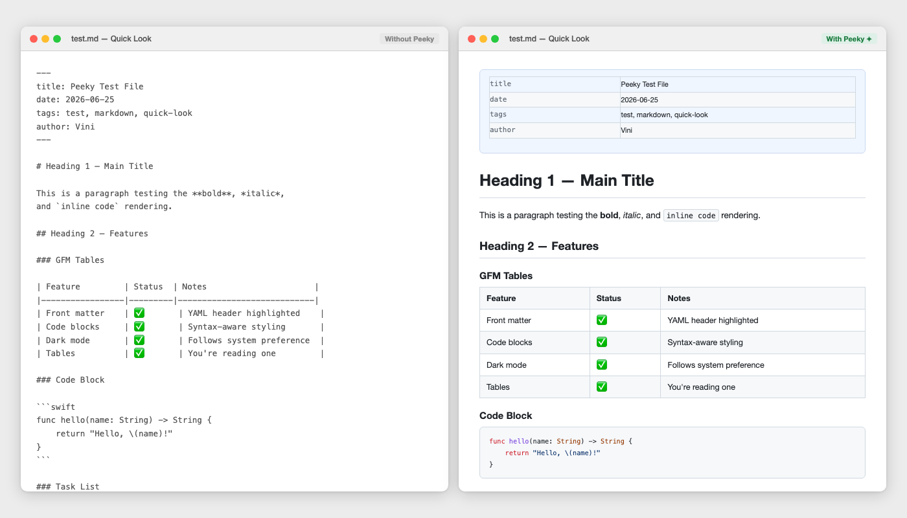

<div align="center">
  
</div>

# Peeky

**See your Markdown. Don't open it.**

Peeky is a macOS Quick Look extension that renders `.md` files as beautiful HTML — just press **Space** in Finder.



---

## Why

macOS previews images, PDFs, and code files natively. Markdown shows up as plain text. If you work with `.md` files daily (notes, docs, AI outputs, READMEs), opening each one in an editor just to read it is friction you shouldn't have.

Peeky makes Markdown a first-class citizen on your Mac.

---

## When it clicks

- **Checking a README before cloning** — browse a project folder, Space on `README.md`, done. No editor launch needed.
- **Reviewing docs without opening the project** — `CONTRIBUTING.md`, `CHANGELOG.md`, `CLAUDE.md` — read them in Finder without spinning up VS Code or Xcode.
- **Glancing at AI outputs** — exported chat sessions, prompt files, generated plans. Readable in one keystroke.
- **Reading your own notes** — daily notes, meeting summaries, project briefs. The right format, instantly.
- **Skimming a proposal or spec** — someone sent a `.md` file. You open Finder, hit Space, and get structured, formatted content — not a wall of raw Markdown syntax.
- **Anywhere you'd say "let me just quickly open this"** — that "quickly" is now just Space.

---

## Features

- **Instant preview** — Space bar on any `.md` file
- **GitHub-flavored Markdown** — headings, tables, task lists, code blocks
- **Syntax highlighting** — automatic language detection in code blocks
- **Dark mode** — follows your system theme automatically
- **Front matter** — YAML metadata rendered cleanly at the top
- **Clickable links** — external URLs open in your browser
- **Settings** — control font size, content width, and theme override

---

## Install

### Homebrew (recommended)
```bash
brew install --cask peeky
```

### Direct download
Download the latest `.dmg` from [Releases](https://github.com/bankks/peeky/releases).

After installing:
1. Open **Peeky.app** once to register the extension
2. Press **Space** on any `.md` file in Finder

---

## Requirements

- macOS 14.0 (Sonoma) or later

---

## Build from source

```bash
# Install xcodegen if you don't have it
brew install xcodegen

# Clone and build
git clone https://github.com/bankks/peeky
cd peeky
xcodegen generate
open Peeky.xcodeproj
```

Build & run the **Peeky** scheme in Xcode. The Quick Look extension registers automatically.

---

## Typography

Peeky's identity uses [Saira](https://fonts.google.com/specimen/Saira) — a geometric sans-serif designed for digital interfaces. The app icon is derived from the "ee" letterforms in the wordmark.

---

## Roadmap

- [x] Basic Markdown → HTML rendering
- [x] Dark mode
- [x] Front matter YAML
- [x] Syntax highlighting
- [x] Settings panel
- [ ] Clickable relative links (open linked .md files in Quick Look)
- [ ] Custom CSS themes
- [ ] Obsidian callouts support
- [ ] Optional anonymous usage analytics

---

## License

MIT — use freely, attribute kindly.

---

*Built by [Vini Diascanio](https://linkedin.com/in/vini-diascanio) as a public case study in PM-led product development.*
